# Car Game

### 🚗 Network Programming Midterm Project

---

## 📌 Project Overview
- **Game Genre**: Multiplayer Racing Game
- **Development Environment**: Unity
- **Team Size**: Solo Development
- **Goal**: To implement a multiplayer game using UDP communication and a client-server architecture with a ranking system

---

## 🔑 Key Technologies
- **Unity**
  - Game client development
  - Player movement and UI implementation

- **C#**
  - Server and client logic implementation
  - UDP network communication handling

- **UDP Networking**
  - Real-time player position synchronization
  - Game state data transmission

- **Database**
  - Player record storage
  - Ranking data management

- **3-Tier Architecture**
  - Separation of client, server, and database
  - Server-side database access handling

---

## 🤔 What I Learned

- At first, I tried to handle all data directly on the client side, but the project structure became overly complicated.  
  By separating responsibilities between the client and the server, the overall system became much more stable and easier to manage.

- I implemented database access through the server instead of allowing the client to access it directly.  
  Through this process, I was able to better understand the advantages of the 3-Tier architecture.

- I learned that UDP communication is faster than TCP but may suffer from packet loss.  
  Implementing real-time position synchronization helped me understand why UDP is suitable for multiplayer games.

---

## 📄 Project Resources

- **Project Presentation**
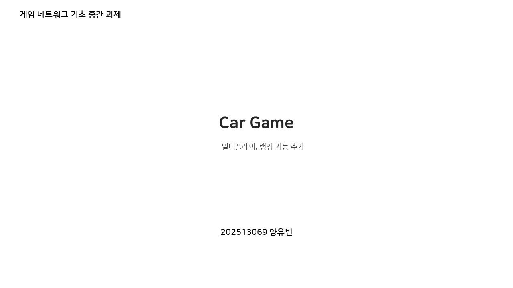
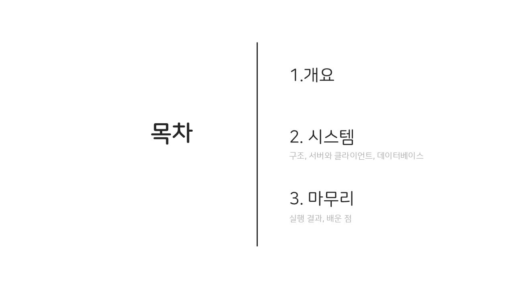
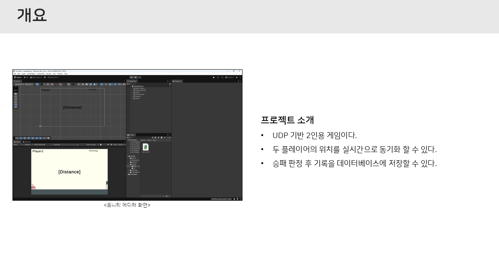
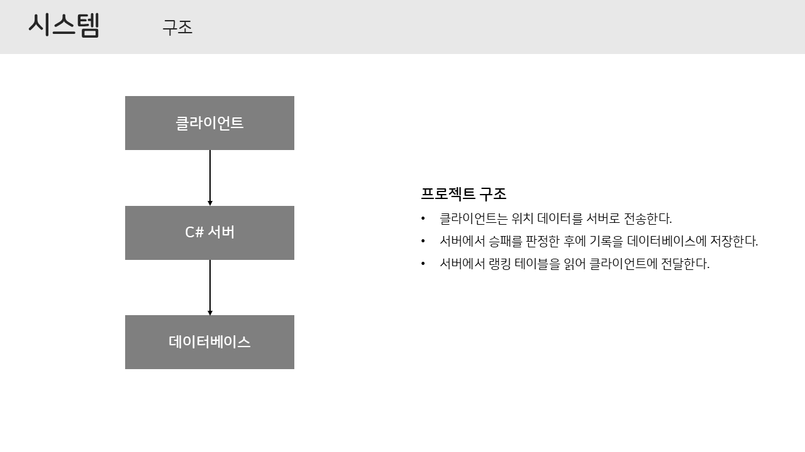
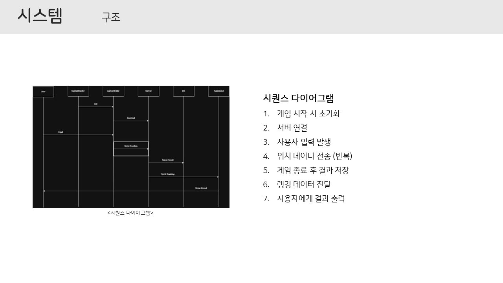
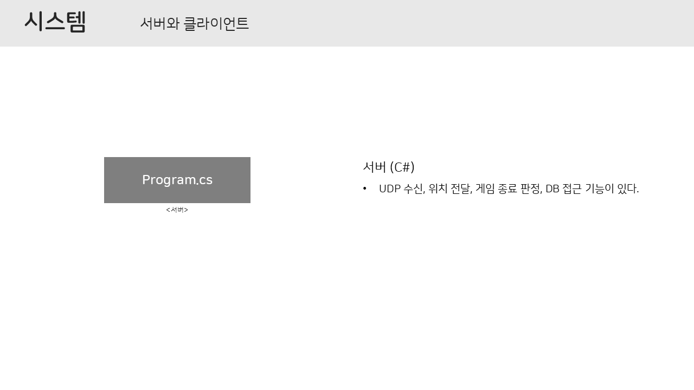
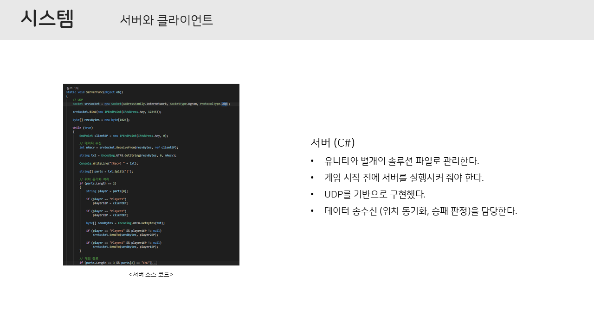
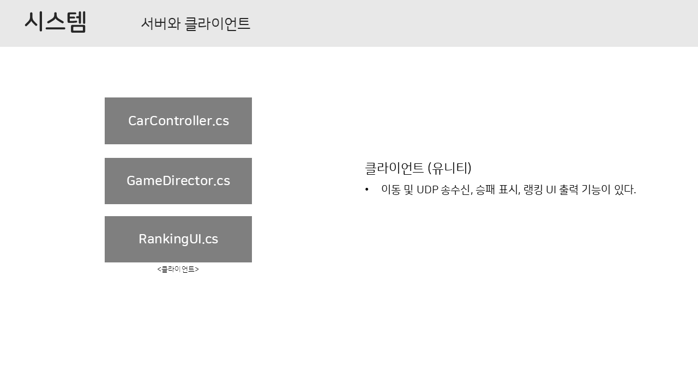
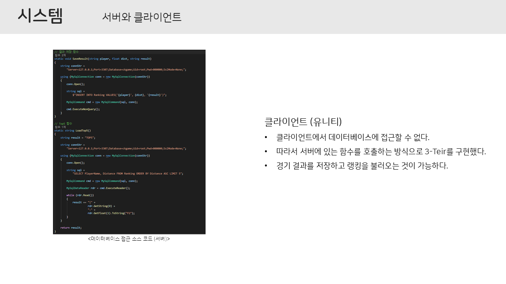
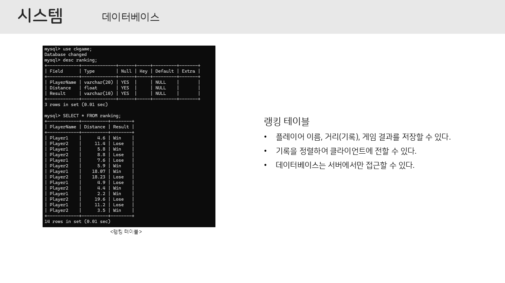
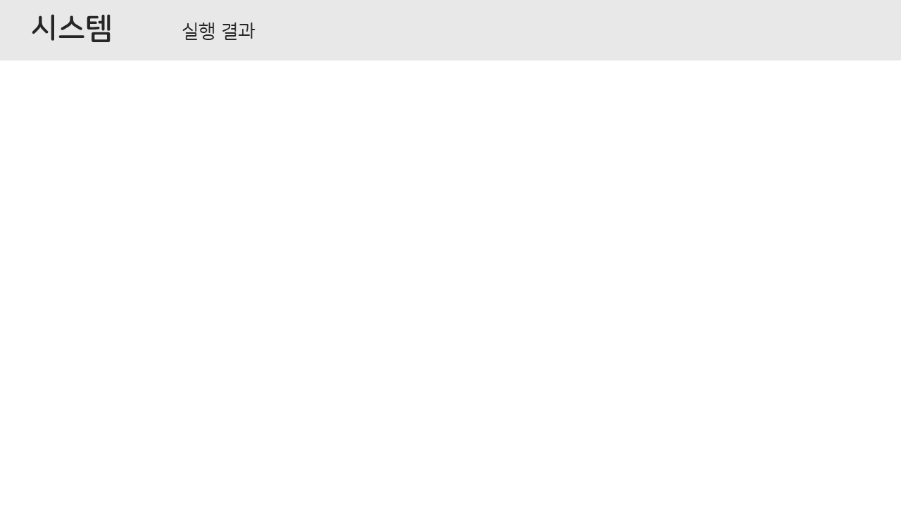
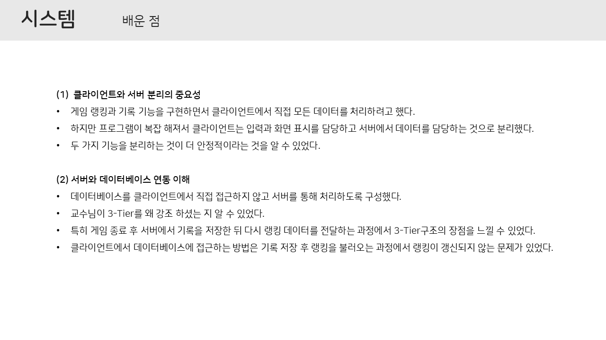

- **Project UML**
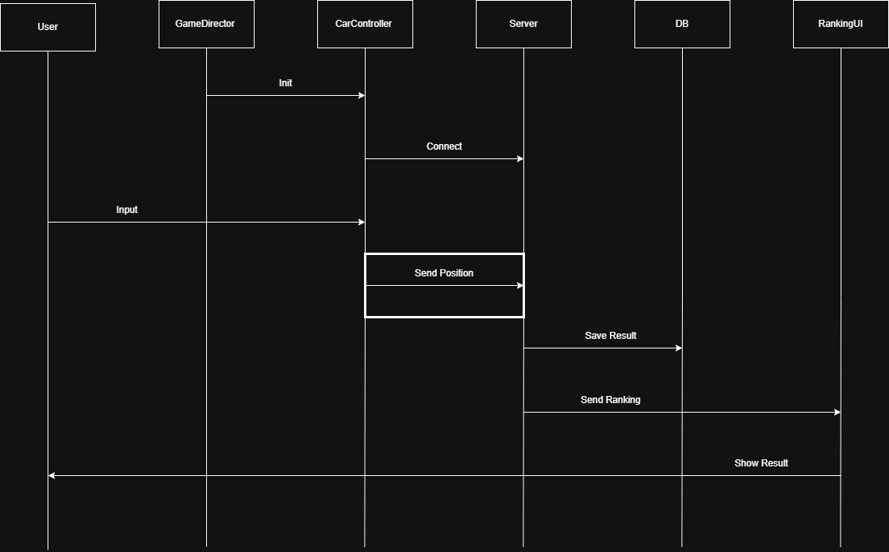

- **Project Video (YouTube)**

- **Goggle Drive**
[Goggle Drive] (https://drive.google.com/drive/folders/1y6CwHdgqR_MgdEvxoiEjy8reGpqzKgWq?usp=sharing)
